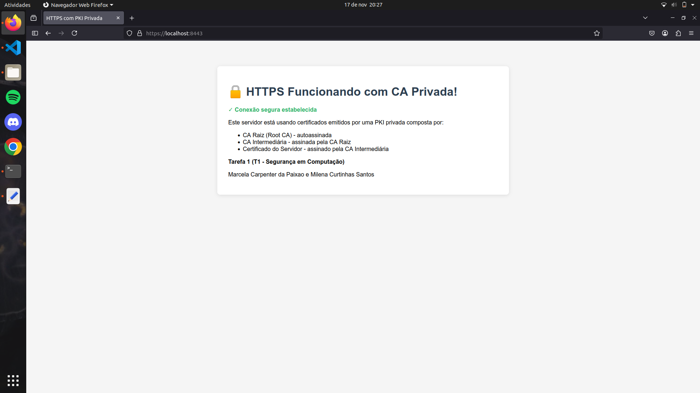
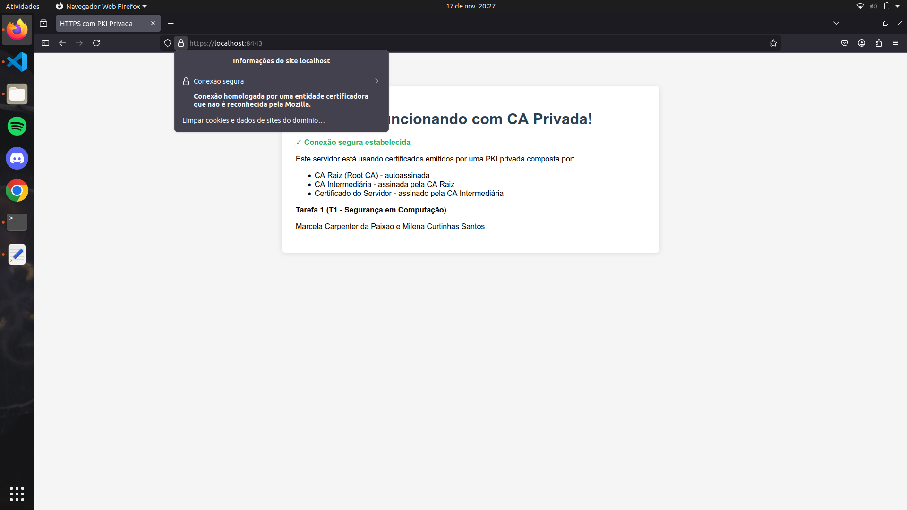

# 
 Relatório do Trabalho T1 

## 
  Segurança em Computação – 2025/2 
## 
 Infraestrutura de Certificação Digital: Let's Encrypt e PKI Própria

---

### Informações do Grupo
- **Disciplina:** Segurança em Computação 2025/2
- **Integrantes:**  
  - Nome: Marcela Carpenter da Paixao   
  - Nome: Milena Curtinhas Santos

---

## 1. Arquitetura do Ambiente
Descreva e desenhe (use figuras) a arquitetura geral dos dois cenários implementados, destacando suas diferenças principais:

- **Cenário 1:** Let's Encrypt + ngrok — uso de uma autoridade certificadora pública para emissão automática de certificados válidos por meio do protocolo ACME.  

    A arquitetura geral do cenário Let's Encrypt + ngrok se baseia no uso de uma autoridade certificadora pública (Let's Encrypt) que, por meio do protocolo ACME, automatiza a emissão e renovação de certificados TLS válidos; já o ngrok cria um túnel seguro e expõe um servidor local para a internet através de uma URL pública temporária, possibilitando que o cliente ACME prove o controle do domínio gerado pelo ngrok ao responder aos desafios da Let’s Encrypt, permitindo obter automaticamente certificados confiáveis para ambientes locais expostos publicamente, com renovação gerenciada pela própria ACME, facilitando o desenvolvimento, testes e demonstrações seguros via HTTPS mesmo em servidores sem IP fixo ou configuração complexa de DNS. Em contraste, uma PKI própria oferece controle total sobre a autoridade certificadora e as políticas de emissão, permitindo personalização para ambientes internos, mas exige manutenção de infraestrutura, não é automaticamente reconhecida por navegadores e sistemas externos, e precisa que os usuários importem manualmente a CA raiz para confiar nos certificados emitidos.

- **Cenário 2:** PKI própria (Root + Intermediária) — criação e operação de uma infraestrutura de chaves públicas local, com emissão de certificados assinados por uma CA interna.

    O cenário 2 apresenta uma infraestrutura de chaves públicas (PKI) própria, composta por uma CA raiz e uma CA intermediária. A CA raiz é a autoridade máxima, autoassinada e isolada para proteção máxima, responsável por emitir e assinar o certificado da CA intermediária, que funciona como um intermediário para emitir certificados aos servidores ou usuários finais. Essa arquitetura em camadas permite que a CA raiz permaneça offline ou com acesso restrito, aumentando a segurança, enquanto a CA intermediária realiza as operações diárias de emissão e revogação de certificados, delegando autoridade da raiz. A PKI própria assim permite maior controle e personalização da cadeia de confiança, mas requer que o certificado da CA raiz seja manualmente importado e confiado nos dispositivos finais para validar os certificados emitidos pela CA intermediária, garantindo uma cadeia confiável e segura dentro do ambiente mas tornando sua aceitação limitada a ambientes privados ou controlados. Já no cenário ACME com uma CA pública reconhecida, como o Let's Encrypt, os certificados emitidos são automaticamente confiáveis por navegadores e sistemas operacionais globalmente, sem necessidade de importação manual, facilitando a automação e escalabilidade da emissão e renovação, sendo ideal para ambientes públicos e aplicações na internet, mas com menos controle direto sobre a autoridade certificadora.

---

## 2. Tarefa 1 – HTTPS com Certificado Público (Let's Encrypt + ngrok)

### 2.1. Preparação do Ambiente
- Sistema operacional: Linux - Ubuntu  
- Ferramentas utilizadas: 

    Docker para criar os containers que encapsulam o servidor Nginx; Docker Compose para gerenciar, build e execução do container; Nginx como o servidor web usado dentro do container, configurado para usar os certificados TLS gerados pela sua PKI privada; Python com bibliotecas de criptografia para criação das CAs, geração e assinatura dos certificados por meio de Scripts Python, além do uso de PyOpenSSL para validação da cadeia de certificação via script Python; VSCode para editar Dockerfile, nginx.conf, docker-compose.yml e scripts Python.
  
- Versão do Docker / Nginx: Docker version 28.4.0, nginx version: nginx/1.29.3  
- Descreva e disponibilize a configuração do servidor web e a página de exemplo criada:

    A configuração do servidor web está no arquivo `tarefa1/nginx.conf`, que define um servidor HTTPS escutando na porta 443 para o domínio localhost, usando o certificado TLS localizado em `/etc/nginx/ssl/server_fullchain.crt` e a chave privada em `/etc/nginx/ssl/server_key.key`. O servidor Nginx serve arquivos estáticos do diretório `/usr/share/nginx/html`, cujo conteúdo corresponde à pasta html/ do projeto, incluindo a página inicial `index.html`. Essa página de exemplo é um arquivo HTML básico que demonstra a página que os usuários verão ao acessar o servidor via HTTPS, garantindo que a conexão está protegida e autenticada pelo certificado emitido pela sua infraestrutura PKI.

### 2.2. Exposição com ngrok
- Domínio público gerado: ______________________________  
- Explique como o túnel foi utilizado para permitir a validação do domínio pelo Let's Encrypt.

### 2.3. Emissão do Certificado
- Caminho do certificado gerado: _________________________  
- Explique o processo de validação e emissão e quais arquivos foram gerados.

### 2.4. Configuração HTTPS no Nginx
- Descreva como foi feita a configuração do servidor para uso do certificado emitido.

    A configuração do servidor foi realizada configurando o Nginx em um container Docker para servir HTTPS utilizando os certificados gerados pela infraestrutura PKI criada em Python, onde o arquivo `server-fullchain.pem` contém a cadeia completa de certificados (servidor, intermediária, raiz) e a chave privada do servidor está no arquivo `server_key.key`; estes arquivos foram montados como volumes no container Nginx e referenciados na configuração do Nginx para ativar a camada de segurança SSL, enquanto a porta 8443 foi exposta para acesso externo, e para que os navegadores confiem na conexão segura, é necessário importar o certificado da CA raiz manualmente no navegador, garantindo assim uma comunicação segura e validada pela cadeia de certificação criada.

### 2.5. Resultados e Validação
- URL de acesso: https://localhost:8443/  
- Screenshot da página HTTPS: 

    

- Resultado do comando de verificação: 

    Assinatura OK: <Name(C=BR,ST=Espirito Santo,L=Vitoria,O=Organização fictícia,CN=localhost)> assinado por <Name(C=BR,ST=Espirito Santo,L=Vitoria,O=Organização fictícia,CN=Intermediate CA)>

    Assinatura OK: <Name(C=BR,ST=Espirito Santo,L=Vitoria,O=Organização fictícia,CN=Intermediate CA)> assinado por <Name(C=BR,ST=Espirito Santo,L=Vitoria,O=Organização fictícia,CN=Root CA)>

    Assinatura OK: <Name(C=BR,ST=Espirito Santo,L=Vitoria,O=Organização fictícia,CN=Root CA)> assinado por <Name(C=BR,ST=Espirito Santo,L=Vitoria,O=Organização fictícia,CN=Root CA)>

    Cadeia de certificação completa: OK

- Screenshot do certificado no navegador (cadeado):

    

---

## 3. Tarefa 2 – HTTPS com PKI Própria (Root + Intermediária)

### 3.1. Criação da CA Raiz
- Explique o papel da CA raiz, descreva o processo de criação e a importância na cadeia de confiança.

    A CA Raiz é o ponto mais alto da cadeia de confiança em uma infraestrutura PKI, funcionando como a âncora de confiança para todos os certificados emitidos abaixo dela. O processo de criação da CA Raiz envolve a geração de um par de chaves criptográficas (pública e privada) e a emissão de um certificado autoassinado, que é um certificado firmado pela própria CA, pois não existe uma autoridade superior que a valide. A importância da CA Raiz está no fato de que todos os certificados intermediários e finais dependem da sua credibilidade para serem confiáveis; se a CA Raiz for confiável e segura, a cadeia inteira de certificação é considerada confiável. Como ela é autoassinada, seu certificado precisa estar presente e confiável nos dispositivos clientes (navegadores, sistemas operacionais) para validar corretamente os certificados da cadeia, garantindo comunicação segura e autenticada.

### 3.2. Criação da CA Intermediária
- Explique por que se utiliza uma CA intermediária, descrevendo o processo de criação e seus benefícios em relação à segurança.

    Uma CA intermediária é usada como um elo entre a CA raiz e os certificados finais emitidos aos usuários ou servidores, funcionando como uma extensão delegada da confiança da raiz; sua criação envolve a emissão de um certificado intermediário pela CA raiz, que passa a assinar e emitir certificados para as entidades finais, o que traz benefícios importantes para a segurança, como reduzir a exposição da CA raiz (que permanece offline ou restrita para maior proteção), permitir a segmentação e controle da emissão de certificados por diferentes áreas ou propósitos, além de aumentar a flexibilidade operacional da infraestrutura da PKI) tudo isso contribuindo para uma cadeia de confiança mais segura e gerenciável.

### 3.3. Emissão do Certificado do Servidor
- Caminho do `fullchain.crt`:  /tarefa2/ca-intermediate/certs/server-fullchain.pem  
- Descreva o processo de emissão do certificado do servidor e como ele foi assinado pela CA intermediária.

    O processo de emissão do certificado do servidor começa com a geração de uma chave privada e a criação de uma Solicitação de Assinatura de Certificado (CSR), que contém as informações do servidor, como o nome do domínio. Essa CSR é enviada para a CA intermediária, que utiliza sua chave privada para assinar digitalmente o certificado do servidor, validando sua autenticidade. A assinatura da CA intermediária cria uma ligação de confiança entre o certificado do servidor e a cadeia de certificação, que ligada à CA raiz. Esse processo permite que o certificado do servidor seja reconhecido como válido dentro da cadeia de confiança da PKI, já que a CA intermediária delega autoridade da CA raiz para emitir certificados aos servidores, aumentando a segurança ao manter a CA raiz protegida e usando as CA intermediárias para operações de emissão e revogação de certificados em ambientes controlados.

### 3.4. Importação da CA Raiz no Navegador
Descreva o procedimento adotado para importar o certificado raiz no navegador:  
- Caminho seguido no navegador: 

    Para importar o certificado no FireFox foi acessado o endereço: about:preferences#privacy -> na seção Certificados clique em Ver certificados -> na aba Autoridades, selecione Importar -> foi escolhido o arquivo de certificado da CA raiz (exemplo: ca-root/certs/ca-root.pem) -> e marcada a opção "Confiar nesta autoridade para identificar websites" para permitir que o navegador confie nos certificados emitidos por essa CA.
  
- Resultado esperado: navegador passou a confiar na CA criada? Justifique

    O navegador passou a confiar na CA criada porque o certificado da CA raiz foi manualmente importado e marcado como confiável nas configurações de certificados do navegador. Como consequência, todos os certificados emitidos pela CA intermediária validada por esta raiz passam a ser considerados confiáveis, evitando alertas de segurança e erros relacionados a certificados não confiáveis durante conexões HTTPS. Essa confiança manual é necessária para que uma PKI local ou privada funcione corretamente nos navegadores.

- Inclua uma captura de tela do certificado confiável. 

    

### 3.5. Validação da Cadeia
- Resultado do comando de verificação: 

    Verificando certificado da CA Raiz...

            Subject: C = BR, ST = ES, L = Vitoria, O = UFES, OU = DI, CN = UFES Root CA, emailAddress = admin@ufes.br
    
            Subject Public Key Info:
    
                Public Key Algorithm: rsaEncryption

    Verificando certificado da CA Intermediária...

            Subject: C = BR, ST = ES, O = UFES, OU = DI, CN = UFES Intermediate CA, emailAddress = admin@ufes.br

            Subject Public Key Info:

                Public Key Algorithm: rsaEncryption

    Verificando certificado do servidor...

            Subject: C = BR, ST = ES, L = Vitoria, O = UFES, OU = DI, CN = localhost

            Subject Public Key Info:

                Public Key Algorithm: rsaEncryption

    Validando cadeia de certificação completa...

    ca-intermediate/certs/server.crt: OK

    Cadeia de certificação válida!

- Screenshot do navegador com HTTPS ativo e confiável: 

    

---

## 4. Comparação entre os Dois Cenários
Responda às questões abaixo com base na experiência prática:

- Quais as principais diferenças entre o uso de certificados públicos e privados?

    Certificados públicos são emitidos por autoridades certificadoras reconhecidas globalmente e confiáveis por navegadores e sistemas operacionais, o que garante automaticamente a confiança e validade dos certificados para conexões seguras na internet. Já os certificados privados são emitidos por uma autoridade certificadora própria, que proporciona controle total sobre políticas de emissão, uso e segurança, sendo ideais para ambientes internos ou corporativos, mas exigem que o certificado da CA raiz seja instalado manualmente em cada sistema cliente para que seja confiável, o que limita seu uso fora desse ambiente controlado. Além disso, certificados públicos normalmente possuem processos automáticos de emissão e renovação (por exemplo, via Let's Encrypt e ACME), enquanto certificados privados demandam infraestrutura própria para a gestão da PKI e dos certificados emitidos.

- Em quais cenários cada abordagem é mais adequada?

    Certificados públicos são mais adequados para aplicações expostas na internet que exigem confiança imediata e maior compatibilidade com navegadores e dispositivos, como sites de ecommerce, serviços públicos, sites e qualquer serviço onde usuários externos acessam, pois facilitam a validação automática e garantem a segurança do tráfego. Já certificados privados são ideais para ambientes internos corporativos, redes fechadas, sistemas de comunicação internos, IoT e testes, onde o controle sobre políticas de emissão, custos baixos e flexibilidade são importantes, e a confiança é gerenciada internamente mediante a importação da CA raiz pelos dispositivos e usuários envolvidos.

- Por que a importação da CA raiz é necessária no segundo cenário?  

    A importação da CA raiz é necessária no cenário de PKI privada porque os certificados emitidos não são automaticamente reconhecidos como confiáveis pelos sistemas operacionais e navegadores, que têm pré-carregadas apenas as CAs públicas mais conhecidas. Sem importar manualmente a CA raiz privada, os clientes não conseguem validar a cadeia de confiança do certificado, resultando em alertas de segurança ou rejeição da conexão. Essa importação é o processo de informar aos dispositivos que a autoridade interna é legítima e confiável dentro daquele ambiente controlado, permitindo o uso seguro dos certificados gerados pela PKI própria.

---

## 5. Conclusões
- Apresente as principais lições aprendidas durante o projeto.  

    Foi possível aprender profundamente os conceitos fundamentais de criptografia assimétrica, estrutura e funcionamento de certificados digitais, controle e geração manual das CAs e certificados, além de entender a cadeia de confiança e como validar certificados em ambientes controlados. O uso de linguagens como Python permite automatizar processos complexos de criação, assinatura e gerenciamento dos certificados, desenvolvendo habilidades práticas em scripting e segurança de sistemas

- Explique a importância prática da certificação digital e da confiança em ambientes seguros.

    A certificação digital e a confiança em ambientes seguros são fundamentais para garantir a autenticidade, integridade e confidencialidade das comunicações digitais, protegendo usuários e sistemas contra fraudes, interceptações e ataques cibernéticos. Na prática, a certificação digital permite que as partes envolvidas confirmem a identidade umas das outras, estabelecendo uma cadeia de confiança que assegura que os dados não foram alterados durante a transmissão e que estão acessíveis apenas a destinatários autorizados. Isso é crucial para proteger transações financeiras, troca de informações sensíveis, acesso a sistemas corporativos e qualquer cenário onde a segurança da informação é prioritária, promovendo confiança e segurança em interações online.

---

## Checklist Final
| Item | Status |
|------|--------|
| Servidor Nginx funcional (Docker) | ✅ |
| Certificado Let's Encrypt emitido e válido | ✅ / ❌ |
| PKI própria criada (Root + Intermediária) | ✅ |
| Importação da CA raiz no navegador | ✅ |
| Cadeia de certificação validada com sucesso | ✅ |
| Relatório completo e entregue | ✅ / ❌ |
| Apresentação prática (vídeo) | ✅ / ❌ |

---

